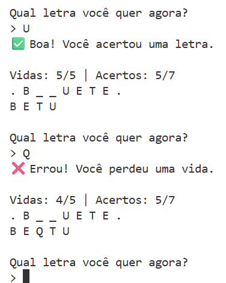

# 🕹️ Jogo da Forca

Vamos desenvolver um **Jogo de Forca**.

A regra do jogo segue o formato tradicional:

---

### 1️⃣ Sorteio da palavra
O jogo deve sortear uma palavra (utilizando a função `proxima` da biblioteca [que você pode baixar aqui](https://github.com/rodrigocane/professorcane/blob/main/PRAP-2025-2/prova/palavras.py) )

---

### 2️⃣ Informação inicial
O jogador é informado de **quantas letras** essa palavra possui.

---

### 3️⃣ Rodadas do jogo
A cada rodada, o jogador deve informar uma letra.

- Se for informada uma letra ainda não revelada, todas as ocorrências dessa letra na palavra são reveladas.

   
  <em>Á é a</em>

- **Se o chute for errado**, o jogador **perde uma vida**. O jogo continua até o jogador acertar a palavra ou errar 5 vezes.

- Se o jogador digitar algo inválido (número, espaço, mais de uma letra, ou uma letra já tentada), o programa deve apenas:
  - Exibir um **aviso de erro**;
  - Solicitar **nova entrada** (sem penalizar).
---

### 4️⃣ Exibição do resumo
Após cada chute, o jogo deve exibir o **resumo da rodada** neste formato:

   
  <em>Formato da saída</em>

---

### 5️⃣ Regras gerais
- Deixe comentários explicando uso de funções mais "incomuns" como `strip()`, `lower()` e congêneres.
- **Personalize** as mensagens exibidas. Seja passivo-agressivo quando o usuário digitar um valor inválido (ex: "Se possível, digite apenas letras. Obrigado."), deboche quando ele chutar errado (ex: "🤣 Tem essa letra não, n00b") ou algo assim. Ou talvez deixe tudo bem explicadinho e sem ambiguidade, se isso for mais a sua cara. O importante é que você ponha o *seu* estilo pessoal na mensagem. Programar também é arte e arte tem que ter assinatura.
- Crie (e utilize) ao menos duas funções para evitar repetir códigos.
- Salve o arquivo principal como *nome.py*. Se seu nome não é único na sala ponha também o sobrenome. Ex: imagine que temos dois (coitados) chamados Aristides. Um deles meteria *aristides_silva.py* e outro *aristides_xavier.py*.
